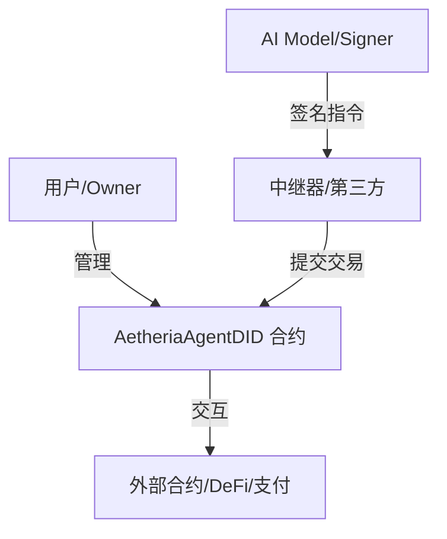

# AetheriaAgentDID (SmartContract1202)

**AetheriaAgentDID** 是专为 AI Agent 设计的链上身份与权限管理系统。它基于 DID（去中心化身份）标准，实现了 Agent 的自主身份、资产管理和基于 EIP-712 的授权操作执行。通过智能合约，赋予 AI Agent 在区块链网络上的独立人格与交互能力。

---

## 🌟 核心特性 (Features)

*   **链上身份 (On-chain Identity)**: 每个 Agent 拥有独立的合约地址作为 DID (`did:ethr:<chainId>:<contract>`)。
*   **权限分离 (Role-based Access)**:
    *   **Owner**: 拥有最高管理权限（转移所有权、设置 Signer、冻结 Agent）。
    *   **Signer**: Agent 的操作执行者（通常为 AI 模型的云端私钥），负责签署交易指令。
*   **委托执行 (Delegated Execution)**: 支持 EIP-712 标准的 `TypedData` 签名，允许第三方或 Relayer 代替 Agent 上链执行操作（Gasless 体验）。
*   **反事实部署 (Counterfactual Deployment)**: 利用 `CREATE2` 预计算 Agent 地址，支持“先充值、后部署”和“首次使用自动部署”。
*   **资产管理 (Asset Management)**: 内置 ETH 和 ERC20 代币的充值、提现与支付功能。
*   **安全机制 (Security)**: 提供紧急冻结 (`freezeAgent`) 功能，在私钥泄露时保护资产安全。

## 🏗️ 系统架构 (Architecture)

AetheriaAgentDID 采用单 Agent 合约模型，即每个 AI Agent 部署一个独立的智能合约。



## 🚀 部署信息 (Deployment Info)

本项目已部署在 **0G Testnet** (Chain ID: `16602`)。

| 合约名称 | 地址 | 说明 |
| :--- | :--- | :--- |
| **AetheriaFactory** | `0xe6AE68CE10f2558C118941e77bEd2E806bD196F9` | 用于创建新的 Agent DID 合约 |

## 📂 目录结构 (Directory Structure)

```text
SmartContract1202/
├── src/                # Solidity 智能合约源码
│   ├── AetheriaAgentDID.sol    # 核心 Agent 合约
│   └── AetheriaFactory.sol     # 工厂合约
├── dashboard/          # 前端管理面板 (React + Vite + Tailwind)
├── sdk/                # 客户端 SDK
│   ├── aiep.js         # JavaScript/TypeScript SDK
│   └── python/         # Python SDK
├── scripts/            # 部署与交互脚本
├── test/               # 合约测试用例 (Hardhat)
├── docs/               # 详细项目文档
└── hardhat.config.js   # Hardhat 配置文件
```

## 🛠️ 快速开始 (Quick Start)

### 1. 智能合约开发

环境要求：Node.js v18+, Hardhat

```bash
# 安装依赖
npm install

# 编译合约
npx hardhat compile

# 运行测试
npx hardhat test

# 部署到 0G Testnet (需配置 .env)
npx hardhat run scripts/deploy.js --network 0g_testnet
```

### 2. 启动前端 Dashboard

Dashboard 提供了一个可视化的界面来管理您的 Agent DID。

```bash
cd dashboard

# 安装依赖
npm install

# 启动开发服务器
npm run dev
```
访问 `http://localhost:5173` 即可查看。

### 3. 使用 SDK 集成

**JavaScript SDK 示例**:

```javascript
const { AetheriaSDK } = require('./sdk/aiep');
const sdk = new AetheriaSDK(provider, factoryAddress);

// 预测 Agent 地址
const agentAddress = await sdk.predictAgentAddress(ownerAddress, salt);

// 部署 Agent
await sdk.createAgent(ownerAddress, salt, signerAddress);
```

**Python SDK 示例**:

```python
from sdk.python.aiep import AetheriaSDK

sdk = AetheriaSDK(provider_url, factory_address)
agent_address = sdk.predict_agent_address(owner_address, salt)
print(f"Agent Address: {agent_address}")
```

## 📚 文档 (Documentation)

更多详细信息请参考 `docs/` 目录下的文档：

*   [项目概览 (AETHERIA_PROJECT.md)](docs/AETHERIA_PROJECT.md)
*   [AIEP 协议规范 (AIEP.md)](docs/AIEP.md)
*   [接口指南 (InterfaceGuide.md)](docs/InterfaceGuide.md)
*   [SDK API 文档 (SDK_API.md)](docs/SDK_API.md)
*   [业务流程架构 (ArchitectureFlow.md)](docs/ArchitectureFlow.md)

## 🤝 贡献 (Contributing)

欢迎提交 Issue 和 Pull Request 来改进本项目。

## 📄 许可证 (License)

MIT License
