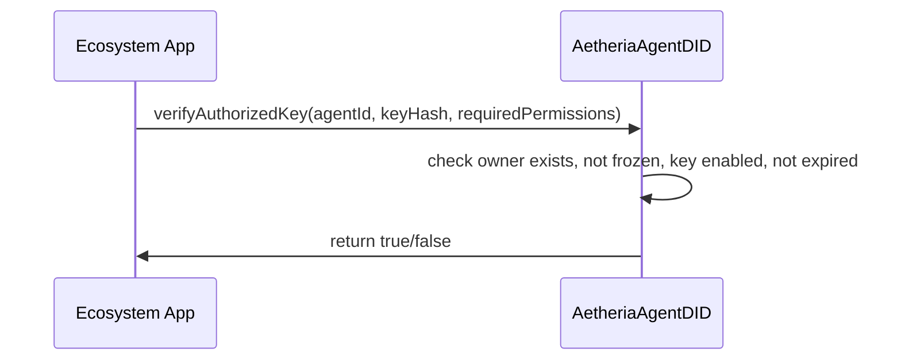
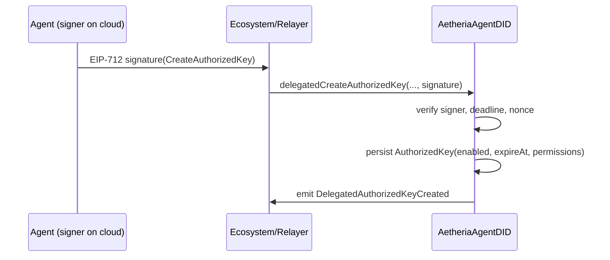
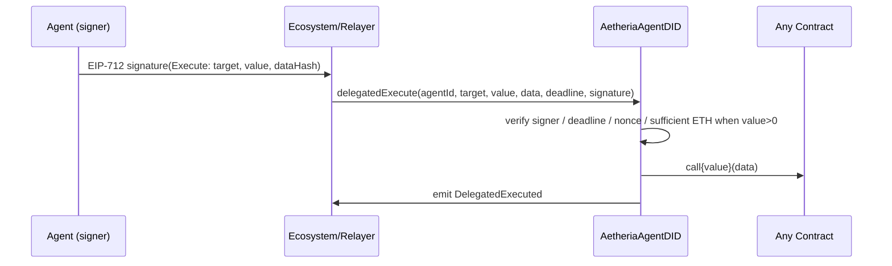
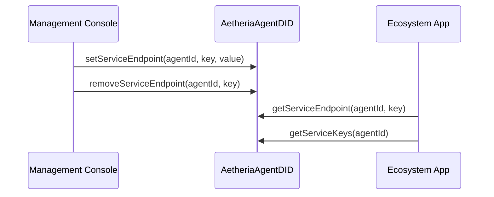

# AetheriaAgentDID 业务流程图（Mermaid + ASCII）

## 总览（角色与主通道）
```mermaid
flowchart LR
  Owner[Agent Owner (Wallet)] --> Console[Management Console (DApp)]
  Console -->|registerAgent / setAgentSigner / setAgentKey / createAuthorizedKey / revokeAuthorizedKey / freeze/unfreeze / set/removeServiceEndpoint| SC[Smart Contract (AetheriaAgentDID)]
  Ecosystem[Ecosystem Apps (Email / Social / Commerce)] -->|verifyAuthorizedKey / didOf / getServiceEndpoint / getServiceKeys| SC
  Agent[Agent (24/7, signer key)] -->|EIP-712 sign| Ecosystem
  Cloud[Cloud Server (owner-managed)] --> Agent
  Any[Anyone] -->|depositToAgent / depositERC20| SC
  Ecosystem -->|delegatedCreateAuthorizedKey / delegatedPayEth / delegatedPayERC20 / delegatedExecute| SC
  SC -->|events: AuthorizedKeyCreated / AgentPaid / AgentPaidERC20 / DelegatedExecuted| Ecosystem
```

说明：
- 管理后台负责身份创建与配置、权限发放与撤销、服务端点维护与应急冻结。
- Agent 在云服务器上持有签名人私钥，离线签名委托数据；生态应用或 relayer 上链执行。
- 智能合约是唯一可信入口：校验签名/权限/过期/冻结/nonce，并生成事件供链下消费。

## 登录授权校验（verifyAuthorizedKey）


## 委托创建访问令牌（delegatedCreateAuthorizedKey）


## ETH 支付委托（delegatedPayEth）
```mermaid
sequenceDiagram
  participant Agent as Agent (signer)
  participant App as Ecosystem/Relayer
  participant SC as AetheriaAgentDID
  Agent->>App: EIP-712 signature(PayEth)
  App->>SC: delegatedPayEth(agentId, to, amount, deadline, signature)
  SC->>SC: verify signer / deadline / nonce / balance
  SC->>SC: ethBalances[agentId] -= amount; send ETH to `to`
  SC->>App: emit AgentPaid
```

## ERC20 支付委托（delegatedPayERC20）
```mermaid
sequenceDiagram
  participant Agent as Agent (signer)
  participant App as Ecosystem/Relayer
  participant SC as AetheriaAgentDID
  Agent->>App: EIP-712 signature(PayERC20)
  App->>SC: delegatedPayERC20(agentId, token, to, amount, deadline, signature)
  SC->>SC: verify signer / deadline / nonce / token balance
  SC->>SC: erc20Balances[agentId][token] -= amount; safeTransfer(token, to, amount)
  SC->>App: emit AgentPaidERC20
```

## 通用委托执行（delegatedExecute）


## 服务端点注册与查询


## ASCII 流程总览（兼容不支持 Mermaid 的环境）
```
[Agent Owner (Wallet)]
        |
        v
[Management Console (DApp)] -- register/set keys/signer/auth/revoke/freeze/service --> [Smart Contract]
       
[Cloud Server] --> [Agent (signer key)] -- EIP-712 signatures --> [Ecosystem Apps]

[Ecosystem Apps] -- delegatedCreateAuthorizedKey / delegatedPayEth / delegatedPayERC20 / delegatedExecute --> [Smart Contract]
[Ecosystem Apps] -- verifyAuthorizedKey / didOf / getServiceEndpoint / getServiceKeys --> [Smart Contract]

[Anyone] -- depositToAgent / depositERC20 --> [Smart Contract]

Events: AuthorizedKeyCreated, AgentPaid, AgentPaidERC20, DelegatedExecuted
```

## 案例要点
- OAuth 登录替代：应用用 `verifyAuthorizedKey` 校验 `requiredPermissions`，通过后创建会话。
- 电话/消息机器人：用 `serviceEndpoint` 标注 webhook / tel/email，第三方按约定投递，先校验授权。
- 电商结算：入金后走 `delegatedPayERC20` 给商户；商户监听事件入账。
- 应急：后台 `freezeAgent` 阻断所有委托与校验；恢复后解冻并轮换主密钥。
```
