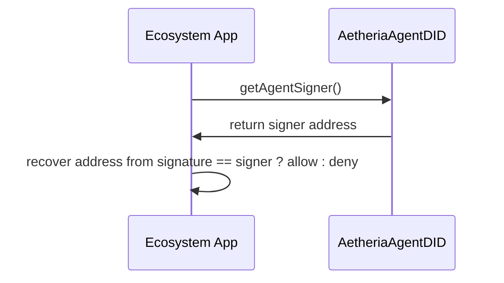
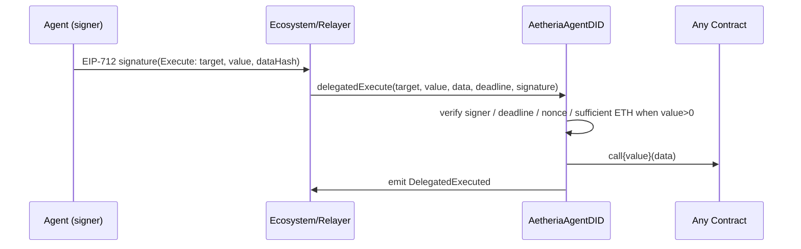
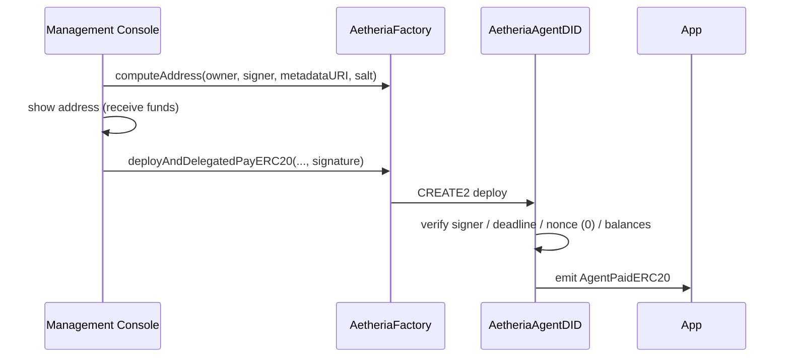
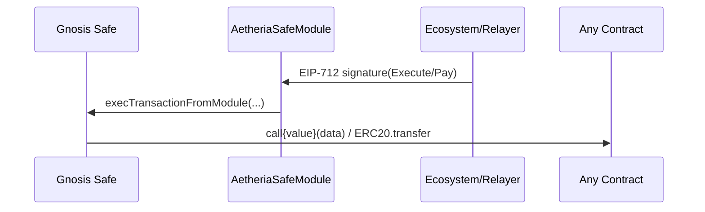

# AetheriaAgentDID 业务流程图（Mermaid + ASCII）

## 总览（角色与主通道）
```mermaid
flowchart LR
  Owner[Agent Owner (Wallet)] --> Console[Management Console (DApp)]
  Console -->|setAgentSigner / freeze/unfreeze| SC[Smart Contract (AetheriaAgentDID)]
  Ecosystem[Ecosystem Apps (Email / Social / Commerce)] -->|did / getAgentSigner| SC
  Agent[Agent (24/7, signer key)] -->|EIP-712 sign| Ecosystem
  Cloud[Cloud Server (owner-managed)] --> Agent
  Any[Anyone] -->|depositToAgent / depositERC20| SC
  Ecosystem -->|delegatedPayEth / delegatedPayERC20 / delegatedExecute| SC
  SC -->|events: AgentPaid / AgentPaidERC20 / DelegatedExecuted| Ecosystem
  subgraph Factory
    F[AetheriaFactory]
  end
  Console -->|computeAddress / deployAgent| F
  F -->|CREATE2 deploy| SC
```

- 说明：
- 管理后台负责身份创建与配置、应急冻结。
- Agent 在云服务器上持有签名人私钥，离线签名委托数据；生态应用或 relayer 上链执行。
- 智能合约是唯一可信入口：校验签名/权限/过期/冻结/nonce，并生成事件供链下消费。

## 登录身份校验（getAgentSigner）


## （移除）委托创建访问令牌
```mermaid
sequenceDiagram
  participant Agent as Agent (signer on cloud)
  participant App as Ecosystem/Relayer
  participant SC as AetheriaAgentDID
  简化架构中不再提供授权令牌创建与校验，统一使用 signer 身份完成认证与委托。
```

## ETH 支付委托（delegatedPayEth）
```mermaid
sequenceDiagram
  participant Agent as Agent (signer)
  participant App as Ecosystem/Relayer
  participant SC as AetheriaAgentDID
  Agent->>App: EIP-712 signature(PayEth)
  App->>SC: delegatedPayEth(to, amount, deadline, signature)
  SC->>SC: verify signer / deadline / nonce / balance
  SC->>SC: ethBalance -= amount; send ETH to `to`
  SC->>App: emit AgentPaid
```

## ERC20 支付委托（delegatedPayERC20）
```mermaid
sequenceDiagram
  participant Agent as Agent (signer)
  participant App as Ecosystem/Relayer
  participant SC as AetheriaAgentDID
  Agent->>App: EIP-712 signature(PayERC20)
  App->>SC: delegatedPayERC20(token, to, amount, deadline, signature)
  SC->>SC: verify signer / deadline / nonce / token balance
  SC->>SC: erc20Balances[token] -= amount; safeTransfer(token, to, amount)
  SC->>App: emit AgentPaidERC20
```

## 通用委托执行（delegatedExecute）



## Factory 反事实部署（computeAddress + deployAgent + 组合交易）


## Safe 模块路径（Gnosis Safe）


## ASCII 流程总览（兼容不支持 Mermaid 的环境）
```
[Agent Owner (Wallet)]
        |
        v
[Management Console (DApp)] -- set signer / freeze/unfreeze --> [Smart Contract]
       
[Cloud Server] --> [Agent (signer key)] -- EIP-712 signatures --> [Ecosystem Apps]

[Ecosystem Apps] -- delegatedPayEth / delegatedPayERC20 / delegatedExecute --> [Smart Contract]
[Ecosystem Apps] -- did / getAgentSigner --> [Smart Contract]

[Anyone] -- depositToAgent / depositERC20 --> [Smart Contract]

Events: AgentPaid, AgentPaidERC20, DelegatedExecuted
```

## 案例要点
- 登录：应用通过 `getAgentSigner` 取链上 signer 地址；对比恢复出的签名地址完成会话创建。
 
- 电商结算：入金后走 `delegatedPayERC20` 给商户；商户监听事件入账。
- 应急：后台 `freezeAgent` 阻断所有委托；恢复后解冻并轮换 signer。
```
